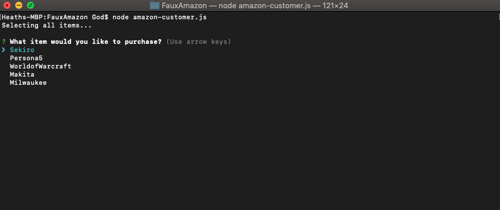
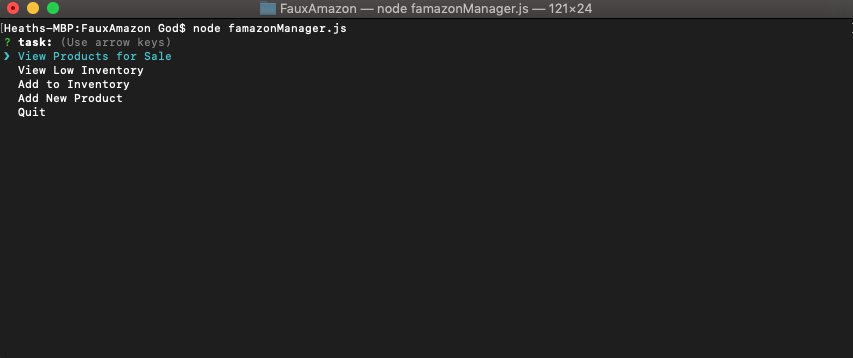
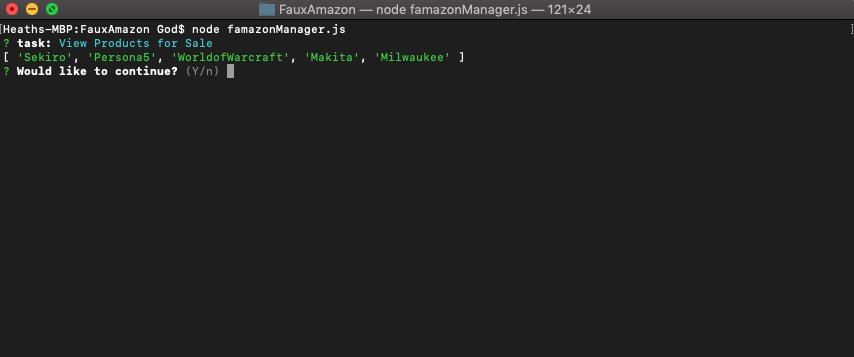
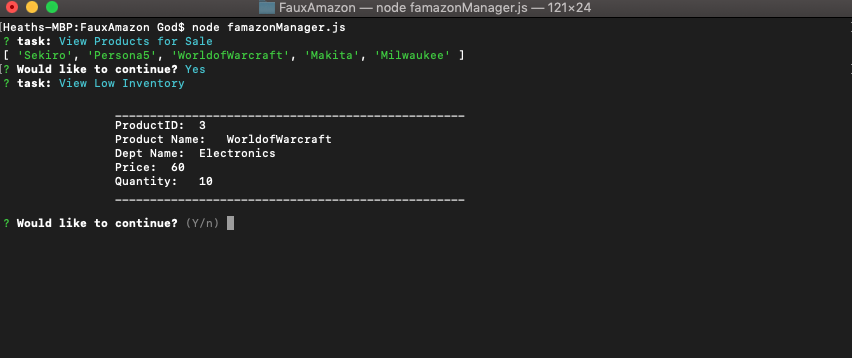
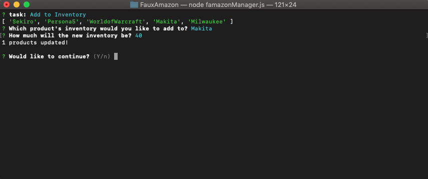
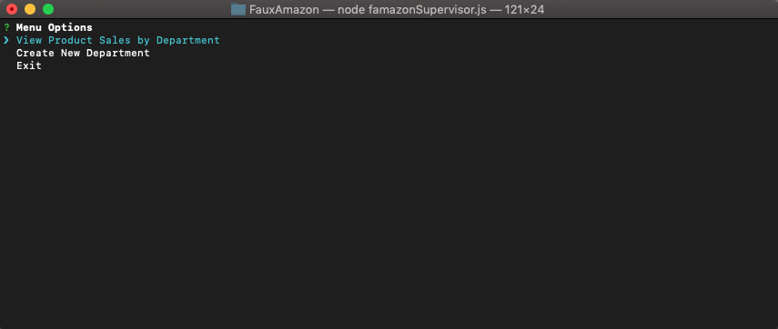
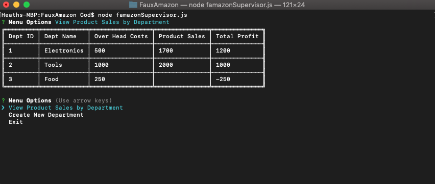
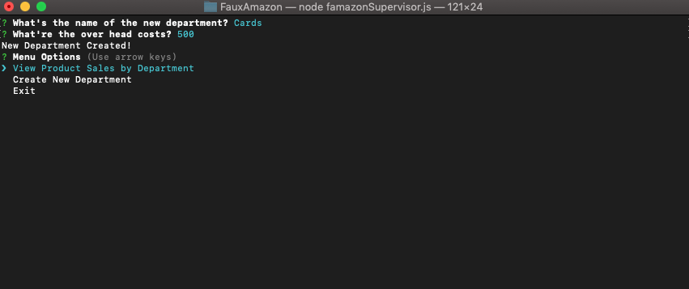

# FauxAmazon

Faux Amazon is a Terminal based application that allows "customers" to purchase items. Once purchased, the database will update with the new quantity and sales for that item.

If an item runs out or becomes low, the manager application can be run to update the product. If there's a new product that needs to be sold, the manager application can insert a new product with pricing, etc. 

The supervisor application will pull all department data and place it into a nice table. If you've a new department, you're able to update it within the database.

# famazon-customer.js

# famazon-manager.js

# famazon-supervisor.js

